# AptekaIS — информационная система управления аптекой

Десктопное приложение на WPF для автоматизации работы аптеки. Включает модули продаж (касса), учёта товаров, работы с поставщиками и заявками на поставку, списания товаров и формирования отчётов с экспортом в Excel. Реализована ролевая модель доступа.

## Скриншоты

### Авторизация
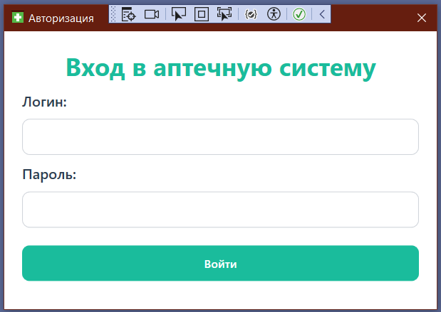

### Касса — продажа товаров
Интерфейс для заведующего (полное меню) и фармацевта (урезанный доступ).

| Заведующий | Фармацевт |
|---|---|
| 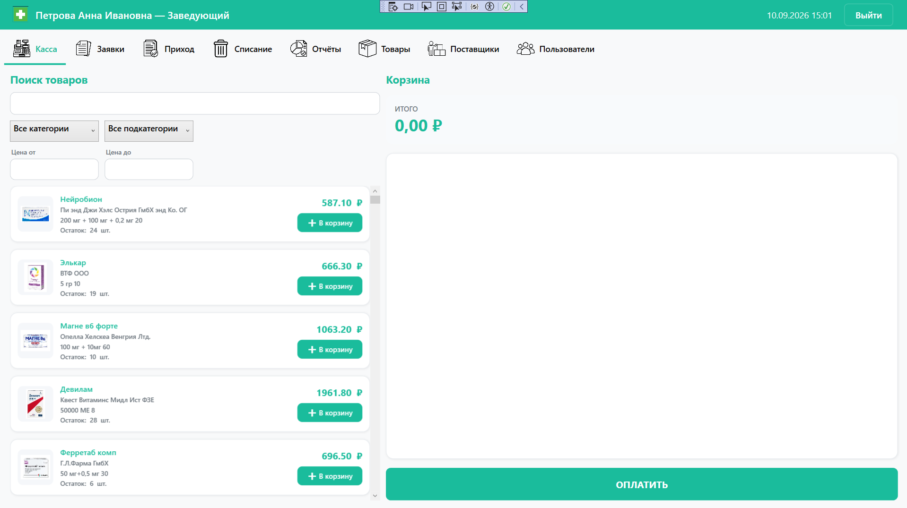 | 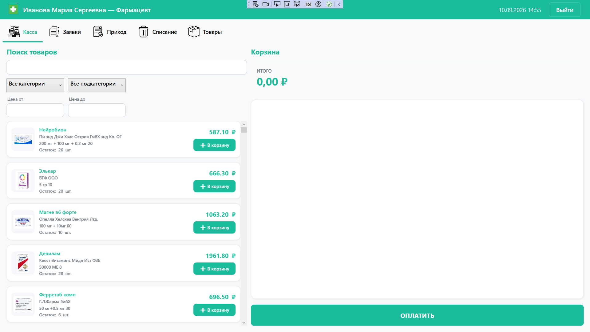 |

### Оформление продажи
| Корзина | Проверка рецептов | Оплата | Чек |
|---|---|---|---|
| 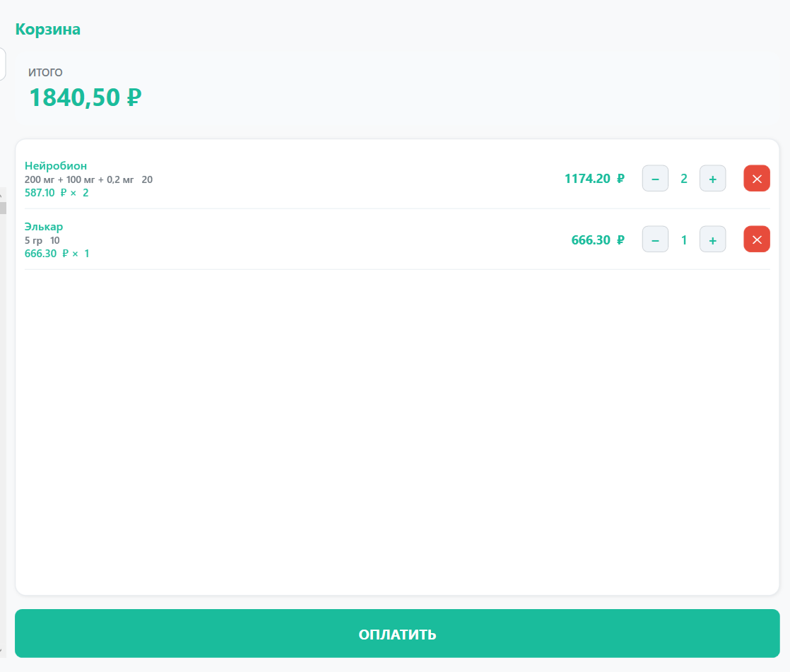 | 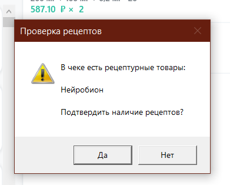 | 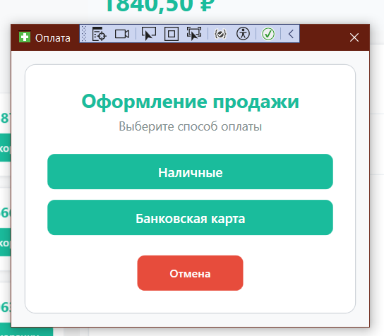 | 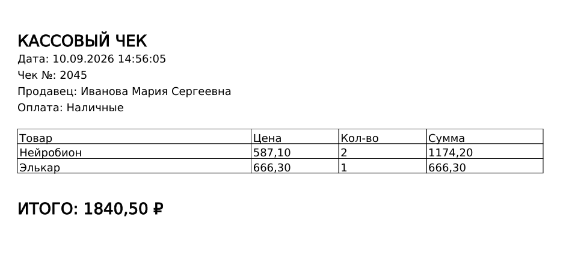 |

### Заявки и приход товара
| Список заявок | Создание заявки | Приёмка товара |
|---|---|---|
| 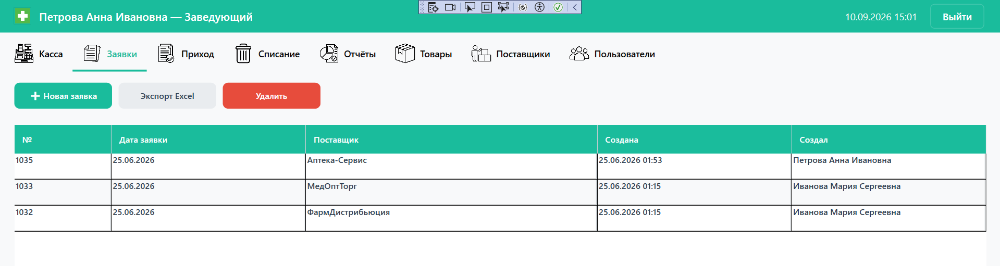 | 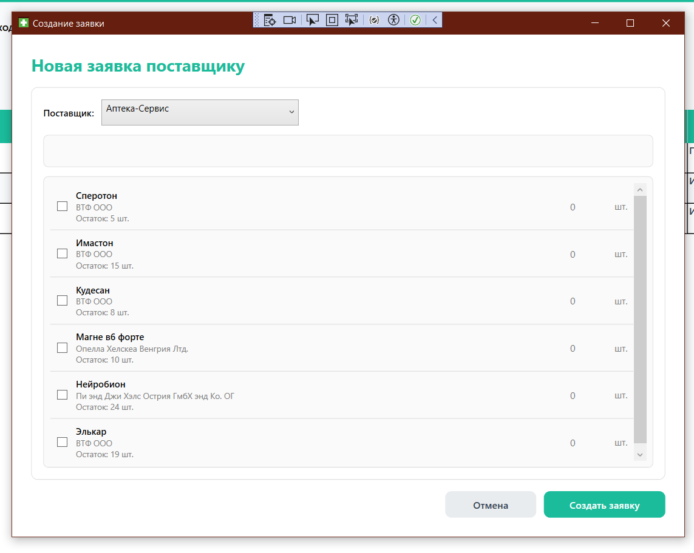 | 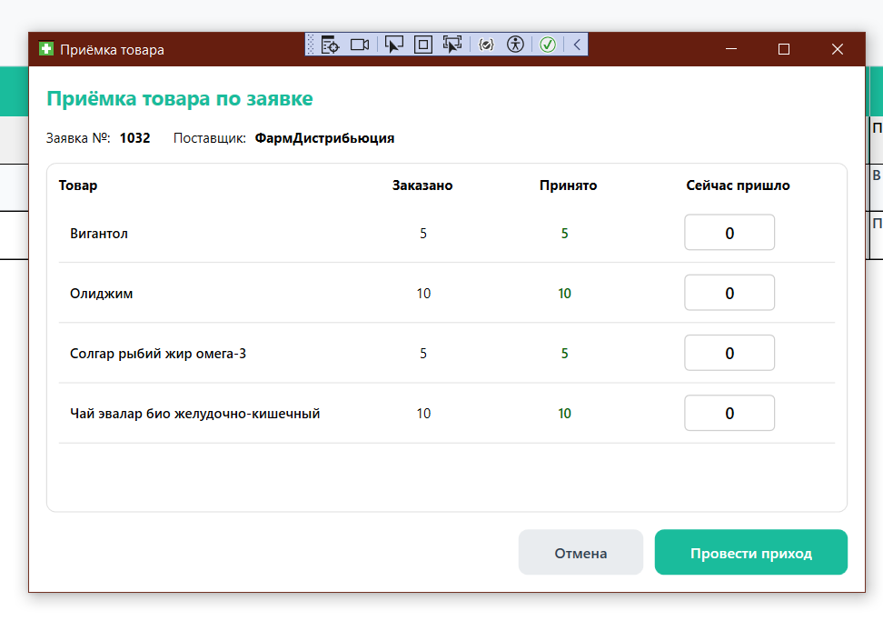 |

### Списание товаров
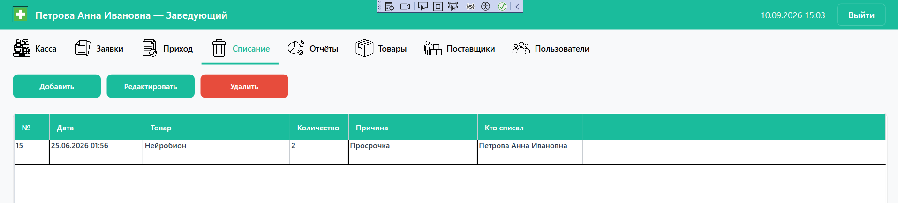

### Отчёты с экспортом в Excel
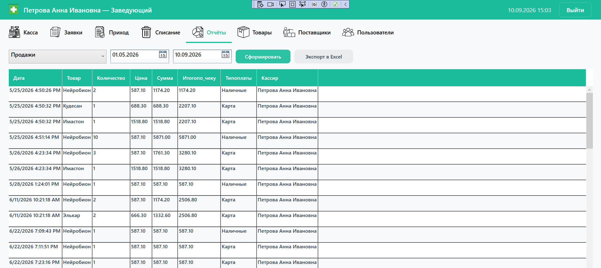

### Каталог товаров
| Заведующий | Фармацевт |
|---|---|
| 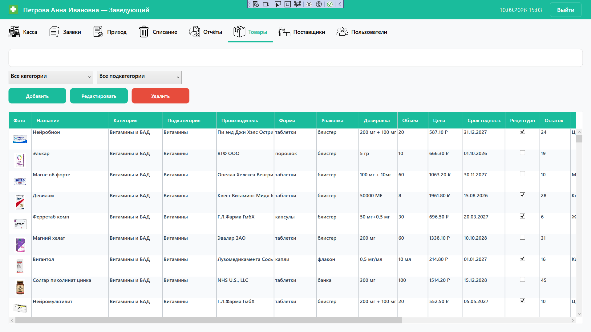 | 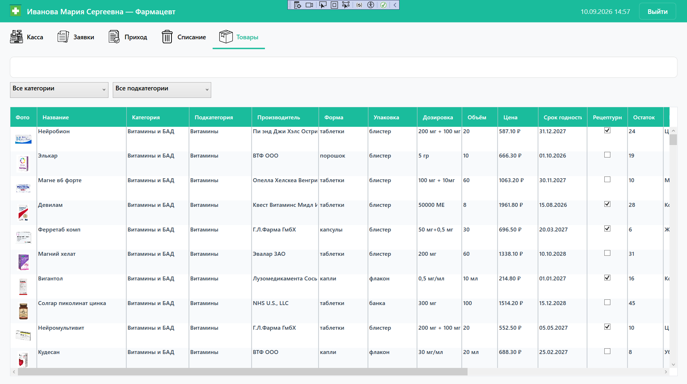 |

### Справочники
| Поставщики | Пользователи |
|---|---|
| 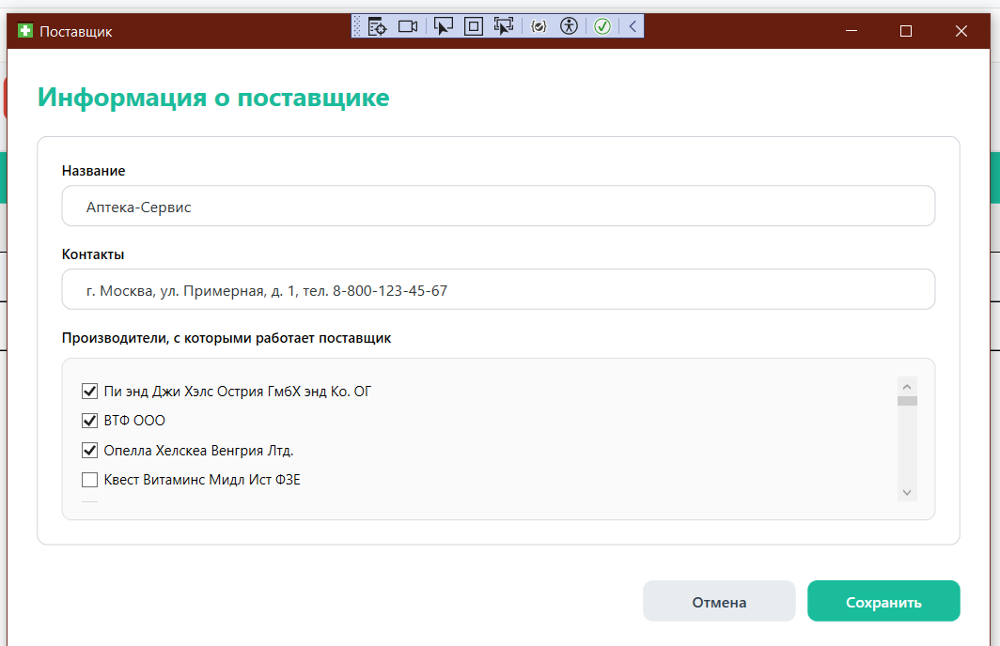 | 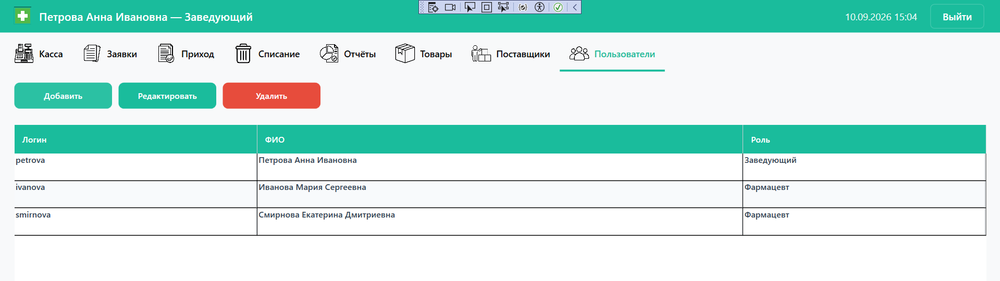 |

## Возможности

- **Касса** — поиск товаров с фильтрами (категория, подкатегория, цена), корзина, оформление продажи наличными или картой, автоматическая проверка рецептурных товаров, печать чека (сохранение в PDF).
- **Заявки поставщикам** — создание заявок с выбором поставщика и товаров, экспорт заявок в Excel, каскадное удаление с приходами.
- **Приход товара** — приёмка товара по заявке с сопоставлением.
- **Списание** — списание товаров с указанием причины.
- **Отчёты** — формирование отчётов по продажам за период, экспорт в Excel.
- **Каталог товаров** — справочник с фото, категориями, производителями, формами выпуска, дозировками, сроками годности, признаком рецептурности и специальными условиями хранения.
- **Справочники** — поставщики (с привязкой производителей) и пользователи системы.
- **Ролевая модель** — разграничение прав между заведующим и фармацевтом.

## Роли пользователей

### Заведующий
Полный доступ ко всем разделам: касса, заявки, приход, списание, отчёты, товары, поставщики, пользователи. Может добавлять, редактировать и удалять записи во всех справочниках, экспортировать отчёты и заявки в Excel.

### Фармацевт
Доступны разделы: касса, заявки, приход, списание, товары. При этом внутри разделов доступ ограничен:

- **Касса** — может оформлять продажи
- **Заявки** — создание заявок; недоступны кнопки «Экспорт Excel» и «Удалить»
- **Приход** — приёмка товара по заявкам
- **Списание** — только добавление списаний; недоступны «Редактировать» и «Удалить»
- **Товары** — только просмотр; недоступны «Добавить / Редактировать / Удалить»

Разделы **Отчёты**, **Поставщики** и **Пользователи** фармацевту недоступны.

## Стек технологий

- **C# / WPF** (.NET Framework 4.8)
- **Entity Framework 6** (Database First, `.edmx`)
- **SQL Server** (база данных `AptekaISDb`)
- **ClosedXML** — экспорт отчётов и заявок в Excel
- **BouncyCastle.Cryptography** — криптография

## Установка и запуск

### Требования
- Visual Studio 2019/2022 с workload «.NET desktop development»
- SQL Server (Express / Developer / LocalDB)
- .NET Framework 4.8

### Шаги

1. **Клонировать репозиторий**
   ```
   git clone https://github.com/Reyka06/AptekaIS.git
   ```

2. **Создать базу данных**
   - Откройте SQL Server Management Studio
   - Создайте пустую БД `AptekaISDb`
   - Выполните скрипт `database/init.sql` — он создаст схему и заполнит БД демонстрационными данными

3. **Настроить строку подключения**
   - Откройте `App.config`
   - В секции `<connectionStrings>` замените `data source=MSI` на имя вашего SQL Server-инстанса
   - Если используете LocalDB — замените на `data source=(localdb)\MSSQLLocalDB`

4. **Собрать и запустить**
   - Откройте `AptekaIS.sln` в Visual Studio
   - `Build → Build Solution` (Ctrl+Shift+B)
   - `Debug → Start Debugging` (F5)

### Демонстрационные учётные записи

| Логин | Пароль | Роль |
|---|---|---|
| `petrova` | `1234` | Заведующий |
| `ivanova` | `1234` | Фармацевт |
| `smirnova` | `1234` | Фармацевт |

## Структура проекта

```
AptekaIS/
├── Models/              # EF-модель и сущности БД
├── Views/               # Окна и UserControls (WPF)
│   └── UserControls/    # Пользовательские контролы для вкладок
├── Converters/          # Конвертеры значений (ByteArray → Image)
├── Styles/              # Стили и темы приложения
├── Resource/            # Иконки и изображения
├── docs/screenshots/    # Скриншоты для документации
├── database/init.sql    # Скрипт создания БД с данными
├── App.config           # Конфигурация (строка подключения)
└── AptekaIS.sln         # Solution-файл
```